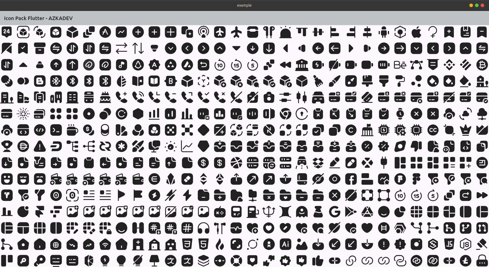
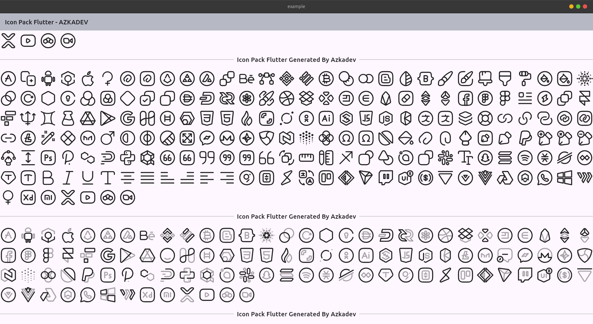

# Icon Pack Flutter

Hai semuanya saya membuat icon pack flutter, sebenarnya tidak 100% karena kebetulan tadi saya gabut dan melihat ada yang posting icon di reddit namun masih dalam bentuk mentahan svg, sehingga mungkin bagi sebagian orang masih belum bisa memakai karena malas jadi saya membuatnya

source icon pack:

https://www.figma.com/design/S7D5rxsHKwUg3I8TOLVtYo/7000-FREE-UI-ICONS--Community-?node-id=1-48280


| 1                        |
|--------------------------|
|  |
|  |
|  |


import

```dart
import 'package:icon_pack_flutter/icon_pack_flutter.dart' as icon_pack_flutter;
```


```dart

icon_pack_flutter.IconPackFlutterWidget(
  assetPath: icon_pack_flutter.IconPackFlutterAssetsAzkadevIconPackOutline.outlineAdditem.assetPath,
)
```


jika sumber icon pack ada pembaruan buat saja issue di github biar saya update / kamu yang coba update


Author: https://github.com/azkadev
repository: https://github.com/azkadev/icon_pack_flutter
21-september-2025